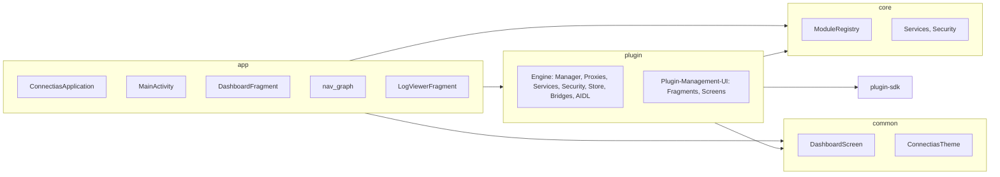

# Plan: Plugin-System in eigenes Modul auslagern (Engine + Plugin-Management-UI)

## 1. Ziel und Umfang

- Neues Gradle-Modul **:plugin** (Android Library) anlegen.
- **Engine** aus app nach :plugin verschieben: Services, Proxies, Manager, Security, Store, Streaming, Version, Messaging, Bridges, AIDL, DI.
- **Plugin-Management-UI** aus app nach :plugin verschieben: PluginManagement, PluginStore, Security-/Network-/Audit-Dashboards, Permission-Detail, Privacy-Dashboard, Plugin-Analytics-Dashboard, Declarative Builder/Runs, Developer Keys.
- **In app verbleiben:** ConnectiasApplication, MainActivity, DashboardFragment, Settings (feature-settings), Log-Viewer, Navigation (nav_graph), R und Start-Destination.

**Abhängigkeiten:** :plugin hängt von :core, :plugin-sdk, :common ab; **:plugin darf nicht von :app abhängen.** App hängt von :plugin ab.

**Paketnamen:** Die bestehenden Paketnamen bleiben unverändert (`com.ble1st.connectias.plugin.*`, `com.ble1st.connectias.core.plugin.*`, `com.ble1st.connectias.ui.plugin.*`, `com.ble1st.connectias.hardware`). Es werden nur Dateien von app nach :plugin verschoben; keine Umbenennung von Paketen. Dadurch müssen **plugin-sdk** und **nav_graph** nicht angepasst werden – Fragment-Klassennamen und SDK-Referenzen bleiben gültig.

---

## 2. Architektur nach der Auslagerung

---

## 3. Schritte im Detail

### Phase 1: Modul :plugin anlegen und Grundgerüst

**3.1 Neues Modul erstellen**

- In [settings.gradle.kts](settings.gradle.kts): `include(":plugin")` ergänzen.
- Verzeichnis `plugin/` anlegen mit:
  - [plugin/build.gradle.kts](plugin/build.gradle.kts): `android.library`, `minSdk = 33`, `namespace = "com.ble1st.connectias.plugin"`, `buildFeatures { aidl = true, compose = true }`, gleiche Kotlin/JVM-Version wie app.
  - Dependencies: `implementation(project(":core"))`, `implementation(project(":plugin-sdk"))`, `implementation(project(":common"))`, Compose-BOM, Material3, Navigation, Fragment, Hilt, Timber, OkHttp, Kotlin Serialization, WorkManager (falls verwendet), ggf. weitere wie in app für die verschobenen Teile.

**3.2 Package-Struktur in :plugin**

- **Paketnamen unverändert lassen** – nur physisch von app nach :plugin verschieben, keine Umbenennung:
  - `com.ble1st.connectias.plugin.*` (Manager, Store, Security, Streaming, Version, Messaging, …) → Verzeichnis `plugin/src/main/java/com/ble1st/connectias/plugin/`.
  - `com.ble1st.connectias.core.plugin.*` (SandboxService, SandboxProxy, UIProcessProxy, UIService, FileSystemBridge, SandboxContext, ClassLoader, …) → Verzeichnis `plugin/src/main/java/com/ble1st/connectias/core/plugin/`.
  - `com.ble1st.connectias.ui.plugin.*` (Fragments/Screens) → Verzeichnis `plugin/src/main/java/com/ble1st/connectias/ui/plugin/`.
  - `com.ble1st.connectias.hardware` → Verzeichnis `plugin/src/main/java/com/ble1st/connectias/hardware/`.
- **Vorteil:** plugin-sdk und nav_graph bleiben unverändert; Fragment-Klassennamen und SDK-Imports bleiben gültig. Nur die R-Referenzen in verschobenen Klassen müssen angepasst werden (Navigation über PluginNavigator, Ressourcen über `com.ble1st.connectias.plugin.R`).

---

### Phase 2: AIDL und Services nach :plugin

**2.1 AIDL verschieben**

- Alle AIDL aus [app/src/main/aidl/](app/src/main/aidl/) nach `plugin/src/main/aidl/` verschieben; **Paketstruktur beibehalten** (keine Umbenennung), damit plugin-sdk und generierte Stubs kompatibel bleiben:
  - `com/ble1st/connectias/plugin/` (IPluginSandbox, IFileSystemBridge, IPermissionCallback, messaging, ui, logging, Parcel-Typen),
  - `com/ble1st/connectias/hardware/` (IHardwareBridge, HardwareResponseParcel).
- In app: AIDL-Dateien und -Verzeichnisse entfernen; `buildFeatures { aidl = true }` in app kann entfallen, sofern app keine eigenen AIDL mehr hat.

**2.2 Service-Deklarationen**

- [plugin/src/main/AndroidManifest.xml](plugin/src/main/AndroidManifest.xml) anlegen und alle Plugin-/Bridge-Services eintragen (wie heute in app), inkl. `android:process`:
  - PluginSandboxService (`:plugin_sandbox`),
  - PluginUIService (`:plugin_ui`),
  - HardwareBridgeService, FileSystemBridgeService, PluginMessagingService (main process).
- Einträge für diese Services aus [app/src/main/AndroidManifest.xml](app/src/main/AndroidManifest.xml) entfernen (Merge übernimmt die Deklarationen aus :plugin).

**2.3 Service- und Proxy-Klassen verschieben**

- Aus app nach :plugin verschieben; **Paketnamen unverändert** (gleiche Verzeichnisstruktur unter `plugin/src/main/java/`):
  - [PluginSandboxService](app/src/main/java/com/ble1st/connectias/core/plugin/PluginSandboxService.kt), [PluginSandboxProxy](app/src/main/java/com/ble1st/connectias/core/plugin/PluginSandboxProxy.kt), [PluginUIProcessProxy](app/src/main/java/com/ble1st/connectias/core/plugin/PluginUIProcessProxy.kt), SandboxApplication, SandboxPluginContext, FileSystemBridgeService → `plugin/.../core/plugin/`.
  - [PluginUIService](app/.../core/plugin/ui/) sowie PluginUIHostImpl, PluginUIControllerImpl, VirtualDisplayManager, PluginPresentation, PluginUIActivity, PluginComposePresentation, PluginUIComposable (UI-Container-Fragments bleiben für „Medium“ in app – siehe Hinweis unten) → `plugin/.../core/plugin/ui/`.
  - HardwareBridgeService und zugehörige Bridges, [PluginMessagingService](app/src/main/java/com/ble1st/connectias/plugin/messaging/PluginMessagingService.kt) → `plugin/.../hardware/` bzw. `plugin/.../plugin/messaging/`.
  - RestrictedClassLoader, FilteredParentClassLoader → `plugin/.../core/plugin/security/`.
- Nur Imports anpassen, die auf app-spezifische Klassen oder app-R verweisen; interne Referenzen innerhalb :plugin bleiben unverändert.

**Hinweis Scope „Medium“:** Für „Engine + Plugin-Management-UI“ bleiben die reinen **Plugin-Container** (PluginUIFragment, PluginUIContainerFragment, PluginUIHostImpl, VirtualDisplayManager), die die Sandbox-UI in der App hosten, optional in app (dann nutzt app nur APIs von :plugin). Wenn gewünscht, können sie ebenfalls nach :plugin – dann :plugin hat alle Plugin-UI inkl. Container.

---

### Phase 3: Engine-Logik nach :plugin

**3.1 Manager, Store, Security, Streaming, Version, Messaging**

- Aus app nach :plugin verschieben (Paketnamen unverändert: `com.ble1st.connectias.plugin.*`, `com.ble1st.connectias.core.plugin.*`):
  - PluginManagerSandbox, PluginManager, StreamingPluginManager, PluginModule (Hilt), VersionedPluginManager, PluginVersionManager, PluginRollbackManager, PluginUpdateService, VersionModule.
  - GitHubPluginStore, StreamingGitHubPluginStore, PluginImportHandler, NativeLibraryManager, PluginDependencyResolverV2, PluginManifestParser, PluginPermissionManager, PluginContextImpl, SecureContextWrapper, PluginExceptionHandler, PluginNotificationManager, PluginFragmentWrapper, PluginMetadata (Duplikat prüfen – plugin-sdk hat evtl. schon Metadata), PluginMetadataParcel, PluginResultParcel, PluginPermissionBroadcast.
  - LazyPluginLoader, MappedPluginLoader, PluginStreamingManager, StreamCache, PluginStreamModels, StreamingModule, SerializationModule.
  - PluginMessageBroker, PluginMessagingProxy.
  - Gesamtes [plugin/security/](app/src/main/java/com/ble1st/connectias/plugin/security/) (ZeroTrustVerifier, SecurityAuditManager, IPCRateLimiter, EnhancedResourceLimiter, PermissionPreChecker, PluginIdentitySession, Secure*Wrapper, EnhancedNetworkPolicy, PluginNetworkTracker, PluginThreadMonitor, …), SecurityModule.
  - Declarative: DeclarativePluginValidator, DeclarativeJson, DeclarativePluginRuntime, DeclarativeFlowEngine, DeclarativePluginPackager, DeclarativeDeveloperTrustStore, DeclarativePluginSignatureVerifier.
- Analytics/Privacy-Logik, die **plugin-seitig** ist (z. B. PluginAnalyticsCollector, PluginAnalyticsStore, PluginAnalyticsRepository; PrivacyAggregator, Export-Modelle), nach :plugin verschieben. Bleiben in app nur die Teile, die explizit „App-weite“ Features sind (z. B. App-Start, Logging-UI), sofern vorhanden.

**3.2 Abhängigkeiten und Context**

- Keine Imports von `com.ble1st.connectias` (app-Paket) in :plugin.
- Context/Application: Alle Klassen, die `Context` oder `Application` brauchen, erhalten sie weiter per Hilt (`@ApplicationContext Context`, ggf. `@Inject lateinit var context: Context`). Die Hilt-Module liegen in :plugin; die app bringt nur `@HiltAndroidApp` und lädt die Module von :plugin (automatisch, sofern :plugin auf dem Classpath ist).
- ModuleRegistry, core-Services: :plugin verwendet sie über `implementation(project(":core"))`; keine Zirkularität.

---

### Phase 4: Plugin-Management-UI nach :plugin

**4.1 Fragments und Screens**

- Alle Fragments und zugehörigen Compose-Screens aus [app/src/main/java/com/ble1st/connectias/ui/plugin/](app/src/main/java/com/ble1st/connectias/ui/plugin/) nach `plugin/src/main/java/com/ble1st/connectias/ui/plugin/` verschieben; **Paketnamen unverändert** (`com.ble1st.connectias.ui.plugin.*`):
  - PluginManagementFragment, PluginManagementScreen, PluginListItem; PluginStoreFragment, PluginStoreScreen; PluginPermissionDetailFragment/Screen; PluginSecurityDashboardFragment, PluginSecurityDashboard, SecurityDashboardScreen; NetworkPolicyConfigurationFragment/Screen, SecurityAuditDashboardFragment/Screen; PrivacyDashboardFragment/Screen; PluginAnalyticsDashboardFragment/Screen; DeclarativePluginBuilderFragment, DeveloperKeysFragment, DeclarativeFlowRunViewerFragment; PluginLoadingProgress.
- nav_graph in app referenziert weiterhin z. B. `com.ble1st.connectias.ui.plugin.PluginManagementFragment` – keine Änderung nötig, da die Klasse nur das Modul wechselt.

**4.2 Navigation ohne Abhängigkeit von app-R**

- Plugin-Fragments dürfen nicht `com.ble1st.connectias.R` (app) verwenden, da :plugin nicht von :app abhängt.
- **Lösung:** Navigation über eine vom Host bereitgestellte Schnittstelle:
  - In :plugin definieren: Interface z. B. `PluginNavigator` (oder `PluginNavDestinations`) mit Methoden wie `navigateToPluginStore()`, `navigateToPermissionDetail(pluginId: String)`, `navigateToSecurityAudit()`, `navigateBack()` usw.
  - App implementiert `PluginNavigator` (z. B. in MainActivity oder Fragment), ruft `findNavController().navigate(R.id.nav_plugin_store)` usw. auf und bindet diese Implementierung per Hilt in den Plugin-Modul (z. B. `@Binds` in app für `PluginNavigator`).
  - Plugin-Fragments/Screens erhalten `PluginNavigator` per `@Inject` und rufen statt `findNavController().navigate(R.id.xyz)` die Methoden von `PluginNavigator` auf.
- Alternativ: Navigation-IDs als Int-Konstanten in ein kleines gemeinsames Modul (z. B. :common oder :plugin-api) legen, das app und :plugin nutzen – dann müsste app die IDs dort hin exportieren. Die sauberere Variante ist das PluginNavigator-Interface in :plugin und die Implementierung in app.

**4.3 Ressourcen (R)**

- Layouts/Strings/Drawables, die ausschließlich von der Plugin-UI genutzt werden, nach `plugin/src/main/res/` verschieben.
- Plugin-Modul nutzt dann `com.ble1st.connectias.plugin.R` (oder den durch `namespace` festgelegten R). Alle Verwendungen von `com.ble1st.connectias.R` in verschobenen Klassen auf die neue R-Klasse umstellen.
- Gemeinsam genutzte Ressourcen (z. B. Theme, Icons aus common): :plugin hängt von :common ab; wo nötig, weiter `common` oder Design-System nutzen.

---

### Phase 5: Hilt und DI

**5.1 PluginModule in :plugin**

- Alle Hilt-Module, die derzeit Plugin-Bindings bereitstellen ([PluginModule](app/src/main/java/com/ble1st/connectias/plugin/PluginModule.kt), [SecurityModule](app/src/main/java/com/ble1st/connectias/plugin/security/SecurityModule.kt), [StreamingModule](app/src/main/java/com/ble1st/connectias/plugin/streaming/StreamingModule.kt), [VersionModule](app/src/main/java/com/ble1st/connectias/plugin/version/VersionModule.kt), NetworkPolicyModule, …), nach :plugin verschieben; Paketnamen unverändert (`com.ble1st.connectias.plugin.*`).
- `@InstallIn(SingletonComponent::class)` beibehalten; keine Referenz auf app-spezifische Komponenten.
- In app: diese Module entfernen; Hilt lädt die Module aus :plugin, weil :plugin als dependency der app auf dem Classpath ist.

**5.2 PluginNavigator-Bindung in app**

- In app: Klasse, die `PluginNavigator` implementiert (z. B. `PluginNavigatorImpl`), und Hilt-Modul, das `PluginNavigator` an diese Implementierung bindet. Die Implementierung nutzt `NavController` (z. B. von MainActivity/Fragment) und app-eigene `R.id.*` für die Plugin-Destinations.
- Sicherstellen, dass alle Plugin-Fragments/Screens, die Navigation auslösen, `PluginNavigator` injiziert bekommen (Constructor oder Field Injection).

---

### Phase 6: App anpassen

**6.1 Abhängigkeit und Bereinigung**

- In [app/build.gradle.kts](app/build.gradle.kts): `implementation(project(":plugin"))` hinzufügen; keine direkte Abhängigkeit mehr auf plugin-sdk für Host-Code, sofern alles über :plugin läuft (ansonsten beibehalten, falls app noch etwas von plugin-sdk braucht).
- Aus app löschen: alle nach :plugin verschobenen Pakete/Dateien (plugin/, core/plugin/, hardware/, ui/plugin/, analytics/ soweit plugin-spezifisch, privacy/ soweit plugin-spezifisch). Keine Duplikate belassen.

**6.2 Navigation**

- [app/src/main/res/navigation/nav_graph.xml](app/src/main/res/navigation/nav_graph.xml): **Keine Änderung nötig.** Die Fragment-Klassennamen bleiben gleich (z. B. `com.ble1st.connectias.ui.plugin.PluginManagementFragment`, `com.ble1st.connectias.ui.plugin.store.PluginStoreFragment`); die Klassen liegen nach dem Verschieben in :plugin, die Referenzen im nav_graph bleiben gültig.

**6.3 Dashboard und MainActivity**

- [DashboardFragment](app/src/main/java/com/ble1st/connectias/ui/dashboard/DashboardFragment.kt): Behält `PluginManagerSandbox`, `ModuleRegistry` (aus core) – beide kommen dann aus :plugin bzw. core. Navigation zu Plugin-Destinations weiter über `findNavController().navigate(R.id.nav_plugin_management)` usw. (R bleibt app-R).
- MainActivity: Keine Änderung nötig, sofern sie nur über Navigation zu Plugin-Fragments geht; falls sie direkt auf Plugin-Klassen zugreift, nur noch Typen aus :plugin importieren.

**6.4 ConnectiasApplication**

- Keine app-spezifischen Plugin-Initialisierungen mehr in Application, die in :plugin gehören; Initialisierung der Plugin-Engine erfolgt über Hilt und ggf. Lazy-Injection von `PluginManagerSandbox` beim ersten Zugriff.

---

### Phase 7: Tests und ProGuard

**7.1 Unit-/Instrumented-Tests**

- Tests, die nur Plugin-Logik betreffen, nach `plugin/src/test/` bzw. `plugin/src/androidTest/` verschieben und Pakete/Imports anpassen.
- Tests in app, die auf Plugin-Klassen zugreifen, können bleiben; sie testen dann die Integration app + :plugin.

**7.2 ProGuard/Consumer-ProGuard**

- [plugin/consumer-rules.pro](plugin/consumer-rules.pro) anlegen und Regeln für Plugin-Services, AIDL-Stubs und Hilt übernehmen (analog zu app, soweit für Library nötig).
- In app: keine zusätzlichen Regeln nötig, sofern :plugin die nötigen keep-Regeln exportiert.

---

## 4. Reihenfolge und Risiken

**Empfohlene Reihenfolge:** (1) Modul anlegen + build.gradle + leeres Manifest; (2) AIDL verschieben und kompilieren; (3) Engine (Services, Proxies, Manager, Security, Store, …) verschieben und Imports/DI anpassen; (4) PluginNavigator einführen und in app implementieren; (5) UI (Fragments/Screens) verschieben und auf PluginNavigator + plugin-R umstellen; (6) app bereinigen, nav_graph anpassen, Tests verschieben/anpassen.

**Risiken:** Große Anzahl verschobener Dateien – Commit am besten in kleinen Phasen (z. B. erst AIDL + Services, dann Rest der Engine, dann UI). Zirkuläre Abhängigkeit vermeiden: :plugin darf weder :app noch ein Modul, das :app transitiv einbindet, dependen.

---

## 5. Kurz-Checkliste

- :plugin Modul in settings.gradle.kts und plugin/build.gradle.kts angelegt
- AIDL nach plugin/src/main/aidl/ verschoben, Services im plugin-Manifest deklariert, aus app-Manifest entfernt
- Alle Engine-Klassen (Services, Proxies, Manager, Security, Store, Streaming, Version, Messaging, Bridges, Core/Sandbox) nach :plugin verschoben, Pakete vereinheitlicht
- PluginNavigator in :plugin definiert, in app implementiert und per Hilt gebunden
- Alle Plugin-UI-Fragments/Screens nach :plugin verschoben, R und Navigation auf PluginNavigator/plugin-R umgestellt
- Hilt-Module in :plugin verschoben, app von doppelten Plugin-Modulen bereinigt
- app/build.gradle.kts: implementation(project(":plugin")), gelöschte Code-Pfade aus app entfernt
- nav_graph: Keine Änderung (gleiche Paketnamen, Fragment-Klassen in :plugin)
- Tests verschoben/angepasst, Build und instrumented Tests grün

