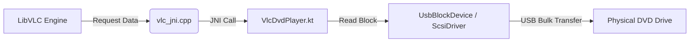

# LibVLC Integration & Custom USB Input Documentation

**Module:** `feature-dvd`  
**Date:** 2025-01-XX  
**Status:** Implemented (Experimental)

---

## 1. Overview

This implementation replaces/augments the ExoPlayer-based playback with **LibVLC for Android**. The primary goal is to support **DVD Menus** and **interactive navigation** (chapters, audio selection), which are not natively supported by ExoPlayer.

A critical challenge is that standard LibVLC expects file paths (e.g., `/sdcard/movie.iso`) or network URLs. Our application reads directly from raw USB Block Devices (SCSI) via the Android USB Host API, without mounting the filesystem. To bridge this, we implemented a **Custom Native Input** mechanism.

---

## 2. Architecture

### Data Flow


### Key Components

1.  **`VlcDvdPlayer.kt` (Kotlin)**
    *   **Role:** The high-level controller.
    *   **Responsibility:** Initializes LibVLC, creates the `MediaPlayer`, and implements the I/O methods (`ioRead`, `ioSeek`) called by the native layer.
    *   **Hacks:** Uses Java Reflection to access the private `mLibVlcInstance` pointer from the `LibVLC` object, which is required to register native callbacks.

2.  **`vlc_jni.cpp` (C++)**
    *   **Role:** The bridge.
    *   **Responsibility:**
        *   Loads `libvlc.so` dynamically via `dlopen` (avoids compile-time linking issues).
        *   Implements `libvlc_media_new_callbacks` to feed data to VLC.
        *   Forwards C-style buffer reads to Kotlin's `ioRead`.

3.  **`vlc_stub.h` (Header)**
    *   **Role:** Minimal SDK.
    *   **Responsibility:** Defines the necessary LibVLC structs and function pointers (`libvlc_media_t`, `libvlc_media_read_cb`) so we can compile the C++ code without downloading the full 100MB+ VLC Source SDK.

4.  **`VlcPlayerScreen.kt` (Compose UI)**
    *   **Role:** The User Interface.
    *   **Responsibility:** Renders the video via `SurfaceView`. Provides an On-Screen D-Pad for DVD menu navigation (Up/Down/Left/Right/Enter).

---

## 3. Implementation Details

### Dynamic Loading Strategy
Instead of linking against `libvlc.so` at build time (which is hard because it's packed inside the AAR), we use `dlopen`:

```cpp
// vlc_jni.cpp
g_libvlc_handle = dlopen("libvlc.so", RTLD_LAZY);
g_libvlc_media_new_callbacks = dlsym(..., "libvlc_media_new_callbacks");
```

This ensures that as long as the `libvlc-all.aar` is in the dependencies, our native code will find the library at runtime.

### Custom Input Callbacks
We bypass the filesystem entirely. When VLC asks for "bytes at offset X", we translate that to:
1.  Calculate LBA (Logical Block Address) = `offset / 2048`.
2.  Send `SCSI READ(10)` command to USB drive.
3.  Return bytes to VLC memory.

### Compilation
*   **CMake:** Updated `CMakeLists.txt` to include `vlc_jni.cpp` and the stub headers.
*   **Gradle:** Added `org.videolan.android:libvlc-all:3.6.0`.

---

## 4. Usage

### Initialization
```kotlin
val player = VlcDvdPlayer(context)
// Automatically loads native libs
```

### Playback
```kotlin
// Play directly from USB driver (Preferred for Menus)
player.playDvd(usbDevice, devicePath, scsiDriver)

// Fallback (if driver fails, e.g. requires root)
player.playDvd(usbDevice, "/dev/bus/usb/...", null)
```

### Navigation
```kotlin
player.navigateUp()
player.navigateEnter() // Select menu item
```

---

## 5. Known Limitations & Future Work

*   **Alignment:** The current `ioRead` implementation assumes VLC requests are somewhat block-aligned or that the `UsbBlockDevice` handles unaligned reads. Complex unaligned partial reads might need a ring buffer in `VlcDvdPlayer`.
*   **Performance:** JNI transitions for every read block can be expensive. Increasing the buffer size in LibVLC (`--network-caching`) helps.
*   **Reflection Risk:** Accessing `mLibVlcInstance` is not a public API. If LibVLC Android changes its internal field names in version 4.0+, this will break and need updating.

---
