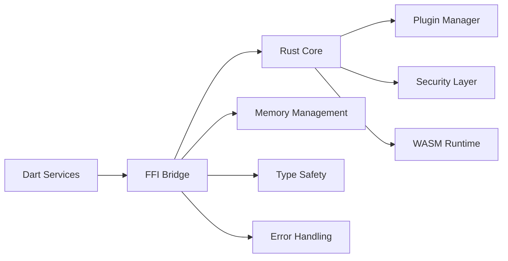

# FFI Bridge Architecture

## Overview

The FFI (Foreign Function Interface) bridge provides secure communication between Dart and Rust components:



## FFI Design Principles

### 1. Safety First
- **Null Pointer Protection**: All pointers are validated before use
- **UTF-8 Validation**: String data is validated for proper encoding
- **Memory Management**: Automatic cleanup of FFI resources
- **Type Safety**: Strict type checking for all operations

### 2. Performance Optimization
- **Zero-Copy Operations**: Minimize data copying between languages
- **Efficient Serialization**: Use binary formats where possible
- **Memory Pooling**: Reuse memory allocations
- **Async Operations**: Non-blocking FFI calls

### 3. Error Handling
- **Comprehensive Error Types**: Detailed error information
- **Error Propagation**: Proper error handling across language boundaries
- **Recovery Mechanisms**: Graceful degradation on errors
- **Logging**: Detailed logging for debugging

## Core FFI Functions

### Plugin Management
```rust
/// Load a WASM plugin
#[no_mangle]
pub extern "C" fn connectias_load_plugin(
    plugin_path: *const c_char,
    plugin_id: *const c_char,
    error_out: *mut *mut c_char,
) -> i32 {
    // Validate input pointers
    if plugin_path.is_null() || plugin_id.is_null() || error_out.is_null() {
        return -1;
    }
    
    // Convert C strings to Rust strings with UTF-8 validation
    let plugin_path_str = match unsafe { CStr::from_ptr(plugin_path) }.to_str() {
        Ok(s) => s,
        Err(_) => {
            unsafe {
                *error_out = CString::new("Invalid UTF-8 in plugin path").unwrap_or_else(|_| CString::new("").unwrap()).into_raw();
            }
            return -1;
        }
    };
    
    let plugin_id_str = match unsafe { CStr::from_ptr(plugin_id) }.to_str() {
        Ok(s) => s,
        Err(_) => {
            unsafe {
                *error_out = CString::new("Invalid UTF-8 in plugin ID").unwrap_or_else(|_| CString::new("").unwrap()).into_raw();
            }
            return -1;
        }
    };
    
    // Load plugin with error handling
    match load_plugin_internal(plugin_path_str, plugin_id_str) {
        Ok(plugin_handle) => plugin_handle,
        Err(e) => {
            // Set error message with fallback
            unsafe {
                *error_out = CString::new(e.to_string()).unwrap_or_else(|_| CString::new("Unknown error").unwrap()).into_raw();
            }
            -1
        }
    }
}

/// Execute a plugin command
#[no_mangle]
pub extern "C" fn connectias_execute_plugin(
    plugin_handle: i32,
    command: *const c_char,
    args_json: *const c_char,
    result_out: *mut *mut c_char,
    error_out: *mut *mut c_char,
) -> i32 {
    // Validate input pointers
    if command.is_null() || args_json.is_null() || result_out.is_null() || error_out.is_null() {
        return -1;
    }
    
    // Convert C strings to Rust strings with UTF-8 validation
    let command_str = match unsafe { CStr::from_ptr(command) }.to_str() {
        Ok(s) => s,
        Err(_) => {
            unsafe {
                *error_out = CString::new("Invalid UTF-8 in command").unwrap_or_else(|_| CString::new("").unwrap()).into_raw();
            }
            return -1;
        }
    };
    
    let args_json_str = match unsafe { CStr::from_ptr(args_json) }.to_str() {
        Ok(s) => s,
        Err(_) => {
            unsafe {
                *error_out = CString::new("Invalid UTF-8 in args JSON").unwrap_or_else(|_| CString::new("").unwrap()).into_raw();
            }
            return -1;
        }
    };
    
    // Execute plugin command with error handling
    match execute_plugin_internal(plugin_handle, command_str, args_json_str) {
        Ok(result) => {
            // Set result with fallback
            unsafe {
                *result_out = CString::new(result).unwrap_or_else(|_| CString::new("").unwrap()).into_raw();
            }
            0
        },
        Err(e) => {
            // Set error message with fallback
            unsafe {
                *error_out = CString::new(e.to_string()).unwrap_or_else(|_| CString::new("Unknown error").unwrap()).into_raw();
            }
            -1
        }
    }
}
```

### Security Operations
```rust
/// Check security status
#[no_mangle]
pub extern "C" fn connectias_check_security(
    status_out: *mut *mut c_char,
    error_out: *mut *mut c_char,
) -> i32 {
    // Validate input pointers
    if status_out.is_null() || error_out.is_null() {
        return -1;
    }
    
    // Check security with error handling
    match check_security_internal() {
        Ok(status) => {
            // Set status with fallback
            unsafe {
                *status_out = CString::new(status).unwrap_or_else(|_| CString::new("").unwrap()).into_raw();
            }
            0
        },
        Err(e) => {
            // Set error message with fallback
            unsafe {
                *error_out = CString::new(e.to_string()).unwrap_or_else(|_| CString::new("Unknown error").unwrap()).into_raw();
            }
            -1
        }
    }
}

/// Check for root access
#[no_mangle]
pub extern "C" fn connectias_is_rooted(
    result_out: *mut i32,
    error_out: *mut *mut c_char,
) -> i32 {
    // Validate input pointers
    if result_out.is_null() || error_out.is_null() {
        return -1;
    }
    
    // Check root status with error handling
    match check_root_status() {
        Ok(is_rooted) => {
            // Set result
            unsafe {
                *result_out = if is_rooted { 1 } else { 0 };
            }
            0
        },
        Err(e) => {
            // Set error message with fallback
            unsafe {
                *error_out = CString::new(e.to_string()).unwrap_or_else(|_| CString::new("Unknown error").unwrap()).into_raw();
            }
            -1
        }
    }
}
```

### Memory Management
```rust
/// Free FFI-allocated memory
#[no_mangle]
pub extern "C" fn connectias_free_string(ptr: *mut c_char) {
    if !ptr.is_null() {
        unsafe {
            let _ = CString::from_raw(ptr);
        }
    }
}

/// Free FFI-allocated memory for multiple strings
#[no_mangle]
pub extern "C" fn connectias_free_strings(ptr: *mut *mut c_char, count: i32) {
    if !ptr.is_null() && count > 0 {
        unsafe {
            for i in 0..count {
                let string_ptr = *ptr.offset(i as isize);
                if !string_ptr.is_null() {
                    let _ = CString::from_raw(string_ptr);
                }
            }
            let _ = Vec::from_raw_parts(ptr, count as usize, count as usize);
        }
    }
}
```

## Dart FFI Bindings

### Plugin Management
```dart
class ConnectiasFFI {
  static final DynamicLibrary _lib = Platform.isAndroid
      ? DynamicLibrary.open('libconnectias_ffi.so')
      : DynamicLibrary.process();
  
  // Load plugin function
  static final int Function(
    Pointer<Utf8> pluginPath,
    Pointer<Utf8> pluginId,
    Pointer<Pointer<Utf8>> errorOut,
  ) _loadPlugin = _lib.lookupFunction<
      int Function(
        Pointer<Utf8> pluginPath,
        Pointer<Utf8> pluginId,
        Pointer<Pointer<Utf8>> errorOut,
      ),
      int Function(
        Pointer<Utf8> pluginPath,
        Pointer<Utf8> pluginId,
        Pointer<Pointer<Utf8>> errorOut,
      ),
    >('connectias_load_plugin');
  
  // Execute plugin function
  static final int Function(
    int pluginHandle,
    Pointer<Utf8> command,
    Pointer<Utf8> argsJson,
    Pointer<Pointer<Utf8>> resultOut,
    Pointer<Pointer<Utf8>> errorOut,
  ) _executePlugin = _lib.lookupFunction<
      int Function(
        int pluginHandle,
        Pointer<Utf8> command,
        Pointer<Utf8> argsJson,
        Pointer<Pointer<Utf8>> resultOut,
        Pointer<Pointer<Utf8>> errorOut,
      ),
      int Function(
        int pluginHandle,
        Pointer<Utf8> command,
        Pointer<Utf8> argsJson,
        Pointer<Pointer<Utf8>> resultOut,
        Pointer<Pointer<Utf8>> errorOut,
      ),
    >('connectias_execute_plugin');
  
  // Free string function
  static final void Function(Pointer<Utf8> ptr) _freeString = _lib.lookupFunction<
      void Function(Pointer<Utf8> ptr),
      void Function(Pointer<Utf8> ptr),
    >('connectias_free_string');
}
```

### High-Level Dart Wrapper
```dart
class ConnectiasService {
  static final ConnectiasService _instance = ConnectiasService._internal();
  factory ConnectiasService() => _instance;
  ConnectiasService._internal();
  
  /// Load a plugin with error handling
  Future<String> loadPlugin(String pluginPath, String pluginId) async {
    final pluginPathPtr = pluginPath.toNativeUtf8();
    final pluginIdPtr = pluginId.toNativeUtf8();
    final errorOutPtr = malloc<Pointer<Utf8>>();
    
    try {
      final result = ConnectiasFFI._loadPlugin(
        pluginPathPtr,
        pluginIdPtr,
        errorOutPtr,
      );
      
      if (result < 0) {
        // Handle error
        final errorPtr = errorOutPtr.value;
        if (!errorPtr.isNull) {
          final error = errorPtr.toDartString();
          ConnectiasFFI._freeString(errorPtr);
          throw ConnectiasError('Failed to load plugin: $error');
        }
        throw ConnectiasError('Unknown error loading plugin');
      }
      
      return result.toString();
    } finally {
      // Cleanup
      malloc.free(pluginPathPtr);
      malloc.free(pluginIdPtr);
      malloc.free(errorOutPtr);
    }
  }
  
  /// Execute a plugin command with error handling
  Future<String> executePlugin(
    String pluginHandle,
    String command,
    Map<String, String> args,
  ) async {
    final commandPtr = command.toNativeUtf8();
    final argsJson = jsonEncode(args);
    final argsJsonPtr = argsJson.toNativeUtf8();
    final resultOutPtr = malloc<Pointer<Utf8>>();
    final errorOutPtr = malloc<Pointer<Utf8>>();
    
    try {
      final result = ConnectiasFFI._executePlugin(
        int.parse(pluginHandle),
        commandPtr,
        argsJsonPtr,
        resultOutPtr,
        errorOutPtr,
      );
      
      if (result < 0) {
        // Handle error
        final errorPtr = errorOutPtr.value;
        if (!errorPtr.isNull) {
          final error = errorPtr.toDartString();
          ConnectiasFFI._freeString(errorPtr);
          throw ConnectiasError('Failed to execute plugin: $error');
        }
        throw ConnectiasError('Unknown error executing plugin');
      }
      
      // Get result
      final resultPtr = resultOutPtr.value;
      if (!resultPtr.isNull) {
        final result = resultPtr.toDartString();
        ConnectiasFFI._freeString(resultPtr);
        return result;
      }
      
      throw ConnectiasError('No result from plugin execution');
    } finally {
      // Cleanup
      malloc.free(commandPtr);
      malloc.free(argsJsonPtr);
      malloc.free(resultOutPtr);
      malloc.free(errorOutPtr);
    }
  }
}
```

## Error Handling

### Error Types
```rust
#[derive(Debug, thiserror::Error)]
pub enum ConnectiasError {
    #[error("Invalid input: {0}")]
    InvalidInput(String),
    
    #[error("Plugin not found: {0}")]
    PluginNotFound(String),
    
    #[error("Plugin execution failed: {0}")]
    PluginExecutionFailed(String),
    
    #[error("Security violation: {0}")]
    SecurityViolation(String),
    
    #[error("Resource exhausted: {0}")]
    ResourceExhausted(String),
    
    #[error("FFI error: {0}")]
    FfiError(String),
}
```

### Error Propagation
```rust
impl From<PluginError> for ConnectiasError {
    fn from(error: PluginError) -> Self {
        match error {
            PluginError::NotFound(id) => ConnectiasError::PluginNotFound(id),
            PluginError::ExecutionFailed(msg) => ConnectiasError::PluginExecutionFailed(msg),
            PluginError::SecurityViolation(msg) => ConnectiasError::SecurityViolation(msg),
            PluginError::ResourceExhausted(msg) => ConnectiasError::ResourceExhausted(msg),
        }
    }
}
```

## Performance Optimization

### Memory Pooling
```rust
pub struct MemoryPool {
    string_pool: Vec<CString>,
    buffer_pool: Vec<Vec<u8>>,
}

impl MemoryPool {
    pub fn get_string(&mut self, s: &str) -> CString {
        // Reuse existing string or create new one
        self.string_pool.pop().unwrap_or_else(|| CString::new(s).unwrap())
    }
    
    pub fn return_string(&mut self, s: CString) {
        // Return string to pool for reuse
        self.string_pool.push(s);
    }
}
```

### Zero-Copy Operations
```rust
pub struct ZeroCopyBuffer {
    data: Vec<u8>,
    offset: usize,
}

impl ZeroCopyBuffer {
    pub fn new(data: Vec<u8>) -> Self {
        Self { data, offset: 0 }
    }
    
    pub fn read_u32(&mut self) -> u32 {
        // Read 4 bytes and construct little-endian u32
        let bytes = [
            self.data[self.offset],
            self.data[self.offset + 1],
            self.data[self.offset + 2],
            self.data[self.offset + 3],
        ];
        self.offset += 4;
        u32::from_le_bytes(bytes)
    }
    
    pub fn read_string(&mut self) -> Result<String, std::str::Utf8Error> {
        // Read string without copying data
        let len = self.read_u32() as usize;
        let string = std::str::from_utf8(&self.data[self.offset..self.offset + len])?;
        self.offset += len;
        Ok(string.to_string())
    }
}
```

## Testing

### FFI Unit Tests
```rust
#[cfg(test)]
mod tests {
    use super::*;
    
    #[test]
    fn test_load_plugin() {
        let plugin_path = CString::new("test.wasm").unwrap();
        let plugin_id = CString::new("test_plugin").unwrap();
        let error_out = Box::new(std::ptr::null_mut::<c_char>());
        
        let result = connectias_load_plugin(
            plugin_path.as_ptr(),
            plugin_id.as_ptr(),
            error_out.as_ref() as *const *mut c_char as *mut *mut c_char,
        );
        
        assert!(result >= 0);
    }
    
    #[test]
    fn test_execute_plugin() {
        // Test plugin execution
        let command = CString::new("test_command").unwrap();
        let args_json = CString::new("{}").unwrap();
        let result_out = Box::new(std::ptr::null_mut::<c_char>());
        let error_out = Box::new(std::ptr::null_mut::<c_char>());
        
        let result = connectias_execute_plugin(
            0, // plugin handle
            command.as_ptr(),
            args_json.as_ptr(),
            result_out.as_ref() as *const *mut c_char as *mut *mut c_char,
            error_out.as_ref() as *const *mut c_char as *mut *mut c_char,
        );
        
        assert!(result >= 0);
    }
}
```

## Next Steps

- [System Overview](system-overview.md)
- [Plugin Lifecycle](plugin-lifecycle.md)
- [Security Architecture](security-architecture.md)
- [API Reference](../api/dart-api.md)
