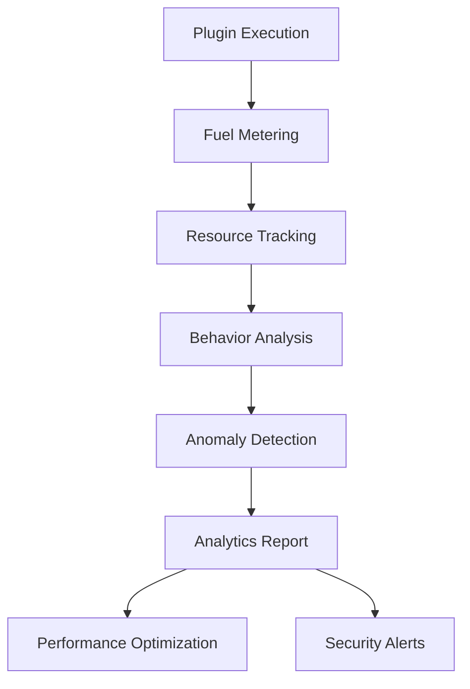

# Fuel Metering Analytics

## Overview

Advanced fuel metering analytics for WASM plugins, providing granular insights into resource consumption, behavior analysis, and anomaly detection.

## Analytics Architecture



## Fuel Consumption Metrics

### 1. Efficiency Score Calculation

```rust
// Efficiency score = expected_fuel / actual_fuel_consumed
pub fn calculate_efficiency_score(&self) -> f64 {
    let expected_fuel = self.calculate_expected_fuel();
    let actual_fuel = self.get_total_consumed();
    
    if actual_fuel > 0 {
        expected_fuel as f64 / actual_fuel as f64
    } else {
        1.0
    }
}
```

**Interpretation**:
- **>1.0**: Efficient execution (good)
- **=1.0**: Expected performance
- **<1.0**: Inefficient execution (investigate)

### 2. Resource Breakdown

| Resource Type | Tracking Method | Cost Per Operation | Analytics |
|---------------|----------------|-------------------|-----------|
| **CPU Cycles** | Instruction counting | Variable | Efficiency score, patterns |
| **Memory Operations** | Allocation tracking | 10-1000 units | Leak detection, usage patterns |
| **Network Calls** | Request/response tracking | 2000-5000 units | Rate limiting, timeout analysis |
| **File Operations** | I/O operation tracking | 1000-1500 units | Access patterns, security |

### 3. Behavior Analysis

#### Pattern Recognition
```rust
pub struct BehaviorAnalyzer {
    baseline_patterns: HashMap<String, u64>,
    anomaly_threshold: f64,
    recent_operations: Vec<OperationPattern>,
}

impl BehaviorAnalyzer {
    pub fn analyze_behavior(&mut self, operation: OperationPattern) -> bool {
        // Detect anomalies based on historical patterns
        self.detect_behavior_anomalies()
    }
}
```

#### Anomaly Detection
- **Excessive CPU Usage**: >500K cycles threshold
- **Memory Leaks**: >1M memory operations
- **Suspicious Patterns**: Rapid repeated operations
- **Efficiency Drops**: Significant performance degradation

## Analytics Reports

### 1. Fuel Report Structure

```rust
#[derive(Debug)]
pub struct FuelReport {
    pub total_consumed: u64,
    pub breakdown: HashMap<InstructionType, u64>,
    pub efficiency_score: f64,
    pub anomalies: Vec<FuelAnomaly>,
    pub timestamp: SystemTime,
    pub plugin_id: String,
}
```

### 2. Report Generation

#### Real-time Monitoring
```rust
// Generate report during plugin execution
let report = fuel_meter.generate_report();
log::info!("Fuel report: {:?}", report);
```

#### Periodic Reports
```rust
// Generate reports every 5 minutes
tokio::spawn(async move {
    let mut interval = tokio::time::interval(Duration::from_secs(300));
    loop {
        interval.tick().await;
        let report = fuel_meter.generate_report();
        analytics_service.send_report(report).await;
    }
});
```

### 3. Report Analytics

#### Performance Metrics
- **Average Efficiency**: Mean efficiency across all plugins
- **Resource Utilization**: CPU, memory, network usage patterns
- **Execution Time**: Plugin execution duration analysis
- **Error Rates**: Failed executions and their causes

#### Security Metrics
- **Anomaly Frequency**: Number of detected anomalies
- **Suspicious Patterns**: Unusual behavior patterns
- **Resource Abuse**: Attempts to exceed limits
- **Security Violations**: Failed security checks

## Performance Optimization

### 1. Adaptive Fuel Limits

```rust
impl AdvancedFuelMeter {
    pub fn adjust_limits_based_on_behavior(&mut self) {
        let report = self.generate_report();
        
        // If efficiency is low, increase limits for legitimate heavy operations
        if report.efficiency_score < 0.5 {
            // Increase limits for this plugin
            self.increase_limits_for_plugin();
        }
    }
}
```

### 2. Resource Optimization

#### Memory Optimization
- **Memory Pooling**: Reuse memory allocations
- **Garbage Collection**: Automatic cleanup of unused resources
- **Memory Limits**: Enforce per-plugin memory quotas

#### CPU Optimization
- **Instruction Optimization**: Reduce expensive operations
- **Parallel Processing**: Distribute workload across cores
- **Caching**: Cache frequently used computations

### 3. Network Optimization

#### Connection Pooling
```rust
pub struct NetworkOptimizer {
    connection_pool: ConnectionPool,
    rate_limiter: RateLimiter,
    timeout_manager: TimeoutManager,
}
```

#### Request Optimization
- **Batch Requests**: Combine multiple requests
- **Compression**: Compress large payloads
- **Caching**: Cache network responses

## Security Analytics

### 1. Threat Detection

#### Resource Abuse Detection
```rust
pub enum SecurityThreat {
    ResourceExhaustion,
    MemoryLeak,
    InfiniteLoop,
    NetworkFlooding,
    FileSystemAbuse,
}
```

#### Behavioral Analysis
- **Unusual Patterns**: Detect abnormal resource usage
- **Attack Signatures**: Identify known attack patterns
- **Anomaly Scoring**: Rate suspicious behavior

### 2. Security Metrics

#### Threat Indicators
- **High CPU Usage**: Potential DoS attacks
- **Memory Leaks**: Resource exhaustion attempts
- **Network Flooding**: DDoS attack patterns
- **File System Abuse**: Unauthorized access attempts

#### Response Actions
- **Automatic Termination**: Stop malicious plugins
- **Resource Quotas**: Limit resource usage
- **Blacklisting**: Block malicious plugins
- **Alerting**: Notify security team

## Analytics Dashboard

### 1. Real-time Metrics

#### System Overview
- **Active Plugins**: Number of running plugins
- **Resource Usage**: Total system resource consumption
- **Performance**: Overall system performance metrics
- **Security Status**: Current security posture

#### Plugin Details
- **Individual Performance**: Per-plugin metrics
- **Resource Consumption**: Detailed resource usage
- **Efficiency Scores**: Performance efficiency ratings
- **Anomaly Detection**: Security and performance anomalies

### 2. Historical Analysis

#### Trend Analysis
- **Performance Trends**: Long-term performance patterns
- **Resource Usage**: Historical resource consumption
- **Security Incidents**: Past security events
- **Optimization Impact**: Effect of optimizations

#### Comparative Analysis
- **Plugin Comparison**: Compare plugin performance
- **Version Analysis**: Performance across versions
- **Environment Comparison**: Different deployment environments

## Integration with Monitoring

### 1. Metrics Collection

#### Prometheus Integration
```rust
use prometheus::{Counter, Histogram, Gauge};

pub struct FuelMetrics {
    fuel_consumed: Counter,
    execution_time: Histogram,
    efficiency_score: Gauge,
    anomaly_count: Counter,
}
```

#### Grafana Dashboards
- **Fuel Consumption**: Real-time fuel usage
- **Performance Metrics**: Execution time and efficiency
- **Security Alerts**: Anomaly detection and threats
- **Resource Utilization**: CPU, memory, network usage

### 2. Alerting

#### Alert Rules
```yaml
# Prometheus alert rules
groups:
  - name: fuel_metering
    rules:
      - alert: HighFuelConsumption
        expr: fuel_consumed > 1000000
        for: 5m
        labels:
          severity: warning
        annotations:
          summary: "High fuel consumption detected"
      
      - alert: LowEfficiency
        expr: efficiency_score < 0.5
        for: 2m
        labels:
          severity: critical
        annotations:
          summary: "Low efficiency score detected"
```

#### Notification Channels
- **Slack**: Real-time alerts
- **Email**: Critical alerts
- **PagerDuty**: Emergency escalation
- **Webhook**: Custom integrations

## Best Practices

### 1. Analytics Implementation

#### Data Collection
- **Minimal Overhead**: Keep analytics overhead <5%
- **Efficient Storage**: Use efficient data structures
- **Real-time Processing**: Process data in real-time
- **Historical Retention**: Keep historical data for analysis

#### Performance Considerations
- **Async Processing**: Use async operations for analytics
- **Batch Processing**: Process data in batches
- **Caching**: Cache frequently accessed data
- **Optimization**: Continuously optimize analytics code

### 2. Security Considerations

#### Data Privacy
- **Anonymization**: Anonymize sensitive data
- **Access Control**: Restrict access to analytics data
- **Encryption**: Encrypt sensitive analytics data
- **Audit Trail**: Log all analytics access

#### Threat Protection
- **Input Validation**: Validate all analytics inputs
- **Rate Limiting**: Limit analytics data collection
- **Resource Limits**: Enforce analytics resource limits
- **Monitoring**: Monitor analytics system itself

## Next Steps

- [Test Matrix](../testing/test-matrix.md)
- [Performance Baseline](../testing/performance_baseline.md)
- [Security Guidelines](../security/security-guidelines.md)
- [Plugin Development Guide](../guides/plugin-development.md)
