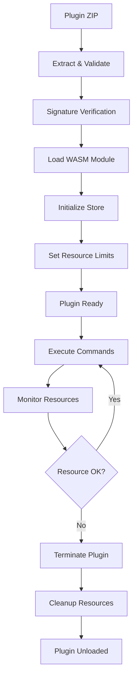

# Plugin Lifecycle

## Overview

The Connectias plugin system follows a strict lifecycle to ensure security and resource management:



## Lifecycle Stages

### 1. Loading Phase

```rust
// Extract plugin from ZIP
let plugin_data = extract_plugin_zip(zip_path)?;

// Validate plugin structure
validate_plugin_structure(&plugin_data)?;

// Verify digital signature
verify_plugin_signature(&plugin_data)?;

// Load WASM module
let wasm_module = load_wasm_module(&plugin_data.wasm_bytes)?;
```

### 2. Initialization Phase

```rust
// Create plugin context
let context = PluginContext {
    plugin_id: plugin_id.clone(),
    permissions: granted_permissions,
    resource_limits: ResourceLimits::default(),
};

// Initialize WASM store
let store = create_wasm_store(&wasm_module, &context)?;

// Set fuel limits
store.set_fuel(1_000_000)?; // 1M fuel units

// Call plugin_init function
let init_result = call_plugin_init(&store)?;
```

### 3. Execution Phase

```rust
// Execute plugin commands
let result = execute_plugin_command(
    &store,
    command,
    args,
    &mut fuel_meter
)?;

// Monitor resource usage
monitor_resource_usage(&store, &fuel_meter)?;
```

### 4. Cleanup Phase

```rust
// Call plugin_cleanup function
call_plugin_cleanup(&store)?;

// Release WASM resources
drop(store);

// Clear plugin data
clear_plugin_data(plugin_id)?;
```

## Resource Management

### Memory Limits
- **Maximum**: 100MB per plugin
- **Monitoring**: Real-time memory usage tracking
- **Action**: Terminate if limit exceeded

### CPU Limits
- **Fuel Metering**: 1M fuel units per execution
- **Instruction Costs**: Variable per operation type
- **Action**: Terminate if fuel exhausted

### Network Limits
- **Rate Limiting**: 100 requests/minute
- **Data Limits**: 10MB per request
- **Timeout**: 30 seconds per request

## Security Checks

### During Loading
- [ ] Digital signature verification
- [ ] Plugin structure validation
- [ ] WASM bytecode verification
- [ ] Permission requirements check

### During Execution
- [ ] Resource usage monitoring
- [ ] Fuel consumption tracking
- [ ] Memory leak detection
- [ ] Network access validation

### During Cleanup
- [ ] Resource deallocation
- [ ] Memory clearing
- [ ] Network connection cleanup
- [ ] Audit log generation

## Error Handling

### Plugin Loading Errors
```rust
pub enum PluginLoadError {
    InvalidSignature,
    CorruptedData,
    UnsupportedVersion,
    PermissionDenied,
    ResourceExhausted,
}
```

### Execution Errors
```rust
pub enum PluginExecutionError {
    FuelExhausted,
    MemoryLimitExceeded,
    NetworkTimeout,
    InvalidCommand,
    SecurityViolation,
}
```

### Cleanup Errors
```rust
pub enum PluginCleanupError {
    ResourceLeak,
    MemoryNotFreed,
    NetworkConnectionOpen,
    AuditLogFailed,
}
```

## Best Practices

### For Plugin Developers
1. **Always implement cleanup functions**
2. **Handle errors gracefully**
3. **Use minimal memory footprint**
4. **Follow security guidelines**
5. **Test resource limits**

### For System Administrators
1. **Monitor plugin resource usage**
2. **Set appropriate limits**
3. **Regular security audits**
4. **Update plugin signatures**
5. **Maintain audit logs**

## Next Steps

- [Security Architecture](security-architecture.md)
- [FFI Bridge](ffi-bridge.md)
- [Plugin Development Guide](../guides/plugin-development.md)
