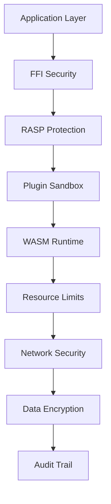

# Security Architecture

## Zero-Trust Security Model

Connectias implements a comprehensive zero-trust security model with multiple layers of protection:



## Security Layers

### 1. Application Layer Security
- **Input Validation**: All user inputs are validated and sanitized
- **Output Encoding**: All outputs are properly encoded to prevent XSS
- **Authentication**: Role-based access control (RBAC)
- **Session Management**: Secure session handling with timeouts

### 2. FFI Security
- **Null Pointer Protection**: All FFI calls validate pointers
- **UTF-8 Validation**: String data is validated for proper encoding
- **Memory Management**: Automatic cleanup of FFI resources
- **Type Safety**: Strict type checking for all FFI operations

### 3. RASP Protection
- **Root Detection**: Automatic detection of rooted/jailbroken devices
- **Debugger Detection**: Prevention of debugging in production
- **Emulator Detection**: Blocking execution in emulated environments
- **Tamper Detection**: Continuous integrity monitoring

### 4. Plugin Sandbox
- **Process Isolation**: Plugins run in isolated processes
- **Resource Quotas**: Strict limits on CPU, memory, and storage
- **Network Isolation**: Controlled network access with filtering
- **File System Isolation**: Restricted file system access

### 5. WASM Runtime Security
- **Fuel Metering**: Granular CPU usage tracking
- **Memory Limits**: Strict memory allocation limits
- **Instruction Filtering**: Blocked dangerous WASM instructions
- **Execution Timeouts**: Automatic termination of long-running operations

## Threat Detection

### Automatic Threat Detection
```rust
pub struct SecurityMonitor {
    root_detector: RootDetector,
    debugger_monitor: DebuggerMonitor,
    emulator_detector: EmulatorDetector,
    tamper_monitor: TamperMonitor,
}

impl SecurityMonitor {
    pub fn check_environment(&self) -> Result<(), SecurityError> {
        // Root detection
        if self.root_detector.is_rooted()? {
            return Err(SecurityError::RootDetected);
        }
        
        // Debugger detection
        if self.debugger_monitor.is_attached()? {
            return Err(SecurityError::DebuggerDetected);
        }
        
        // Emulator detection
        if self.emulator_detector.is_emulated()? {
            return Err(SecurityError::EmulatorDetected);
        }
        
        // Tamper detection
        if self.tamper_monitor.is_tampered()? {
            return Err(SecurityError::TamperDetected);
        }
        
        Ok(())
    }
}
```

### Threat Response
```rust
pub enum SecurityResponse {
    Terminate,      // Immediate app termination
    Quarantine,    // Isolate compromised components
    Alert,         // Log and notify administrators
    Block,         // Block specific operations
}
```

## Encryption Standards

### Data at Rest
- **Algorithm**: AES-256-GCM
- **Key Storage**: Android Keystore / iOS Secure Enclave
- **Key Rotation**: Automatic every 90 days
- **Key Destruction**: Secure deletion with multiple overwrites

### Data in Transit
- **Protocol**: TLS 1.3 only
- **Certificate Pinning**: SPKI-based pinning
- **Cipher Suites**: Only modern, secure ciphers
- **Perfect Forward Secrecy**: Ephemeral key exchange

### Key Management
```rust
pub struct KeyManager {
    keystore: SecureKeystore,
    key_rotation: KeyRotation,
    key_destruction: KeyDestruction,
}

impl KeyManager {
    pub fn generate_key(&self) -> Result<KeyId, KeyError> {
        // Generate hardware-backed key
        self.keystore.generate_key()
    }
    
    pub fn rotate_key(&self, key_id: KeyId) -> Result<KeyId, KeyError> {
        // Rotate key with zero-downtime
        self.key_rotation.rotate(key_id)
    }
    
    pub fn destroy_key(&self, key_id: KeyId) -> Result<(), KeyError> {
        // Securely destroy key
        self.key_destruction.destroy(key_id)
    }
}
```

## Network Security

### TLS Configuration
```rust
pub struct NetworkSecurity {
    tls_config: TlsConfig,
    certificate_pinning: CertificatePinning,
    rate_limiting: RateLimiting,
}

impl NetworkSecurity {
    pub fn create_secure_client(&self) -> Result<HttpClient, NetworkError> {
        let mut client = HttpClient::new();
        
        // Configure TLS 1.3 only
        client.set_tls_version(TlsVersion::Tls13);
        
        // Enable certificate pinning
        client.set_certificate_pinning(self.certificate_pinning.clone());
        
        // Set rate limits
        client.set_rate_limiting(self.rate_limiting.clone());
        
        Ok(client)
    }
}
```

### Security Headers
```http
Strict-Transport-Security: max-age=31536000; includeSubDomains
X-Content-Type-Options: nosniff
X-Frame-Options: DENY
X-XSS-Protection: 1; mode=block
Content-Security-Policy: default-src 'self'
```

## Access Control

### Permission Model
```rust
pub enum PluginPermission {
    // Network permissions
    NetworkAccess,
    NetworkTls,
    NetworkPinning,
    
    // Storage permissions
    StorageRead,
    StorageWrite,
    StorageDelete,
    
    // System permissions
    SystemInfo,
    DeviceInfo,
    
    // Communication permissions
    InterPluginComm,
    NativeAccess,
    
    // Cryptographic permissions
    CryptoAccess,
    KeyAccess,
}
```

### RBAC Implementation
```rust
pub struct PermissionManager {
    roles: HashMap<String, Role>,
    permissions: HashMap<String, Vec<PluginPermission>>,
    audit_log: AuditLog,
}

impl PermissionManager {
    pub fn grant_permissions(&mut self, plugin_id: &str, permissions: Vec<PluginPermission>) -> Result<(), PermissionError> {
        // Grant permissions
        self.permissions.insert(plugin_id.to_string(), permissions);
        
        // Log permission change
        self.audit_log.log_permission_change(plugin_id, "GRANT", &permissions);
        
        Ok(())
    }
    
    pub fn check_permission(&self, plugin_id: &str, permission: PluginPermission) -> bool {
        self.permissions
            .get(plugin_id)
            .map(|perms| perms.contains(&permission))
            .unwrap_or(false)
    }
}
```

## Audit and Monitoring

### Audit Trail
```rust
pub struct AuditLog {
    events: Vec<AuditEvent>,
    retention_period: Duration,
}

#[derive(Debug, Clone)]
pub struct AuditEvent {
    pub timestamp: SystemTime,
    pub event_type: AuditEventType,
    pub plugin_id: Option<String>,
    pub user_id: Option<String>,
    pub details: HashMap<String, String>,
}

pub enum AuditEventType {
    PluginLoad,
    PluginExecute,
    PluginUnload,
    PermissionGrant,
    PermissionRevoke,
    SecurityViolation,
    ResourceExhaustion,
}
```

### Security Monitoring
```rust
pub struct SecurityMonitor {
    metrics: SecurityMetrics,
    alerts: AlertManager,
    reporting: SecurityReporting,
}

impl SecurityMonitor {
    pub fn monitor_security(&self) -> Result<(), SecurityError> {
        // Check for security violations
        let violations = self.detect_violations()?;
        
        // Generate alerts for violations
        for violation in violations {
            self.alerts.send_alert(violation)?;
        }
        
        // Update security metrics
        self.metrics.update(violations);
        
        // Generate security report
        self.reporting.generate_report()?;
        
        Ok(())
    }
}
```

## Security Testing

### Penetration Testing
```rust
pub struct PenetrationTester {
    attack_vectors: Vec<AttackVector>,
    vulnerability_scanner: VulnerabilityScanner,
    security_auditor: SecurityAuditor,
}

impl PenetrationTester {
    pub fn run_penetration_tests(&self) -> Result<PenetrationReport, SecurityError> {
        let mut report = PenetrationReport::new();
        
        // Test attack vectors
        for vector in &self.attack_vectors {
            let result = self.test_attack_vector(vector)?;
            report.add_result(result);
        }
        
        // Scan for vulnerabilities
        let vulnerabilities = self.vulnerability_scanner.scan()?;
        report.add_vulnerabilities(vulnerabilities);
        
        // Audit security configuration
        let audit_result = self.security_auditor.audit()?;
        report.add_audit_result(audit_result);
        
        Ok(report)
    }
}
```

## Compliance

### Security Standards
- **OWASP Mobile Security**: OWASP MASVS compliance
- **NIST Cybersecurity Framework**: NIST CSF implementation
- **ISO 27001**: Information security management
- **SOC 2**: Security, availability, and confidentiality

### Privacy Compliance
- **GDPR**: General Data Protection Regulation
- **CCPA**: California Consumer Privacy Act
- **PIPEDA**: Personal Information Protection and Electronic Documents Act

## Next Steps

- [System Overview](system-overview.md)
- [Plugin Lifecycle](plugin-lifecycle.md)
- [FFI Bridge](ffi-bridge.md)
- [Security Guidelines](../security/security-guidelines.md)
