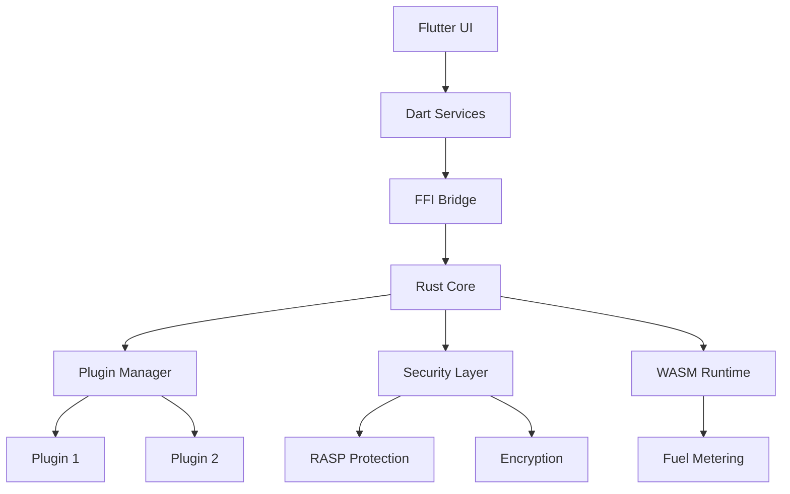

# System Architecture Overview

## High-Level Architecture

## Core Components

### 1. Flutter UI Layer
- **Purpose**: Cross-platform user interface
- **Components**: Plugin Manager, Security Dashboard, Settings
- **Technology**: Flutter 3.35.4, Dart

### 2. Dart Services Layer
- **ConnectiasService**: High-level plugin management
- **SecureStorageService**: Encrypted storage (Android Keystore/iOS Secure Enclave)
- **NetworkSecurityService**: TLS 1.3 + Certificate Pinning
- **PermissionService**: Role-Based Access Control (RBAC)

### 3. FFI Bridge
- **Purpose**: Safe communication between Dart and Rust
- **Technology**: Dart FFI, 25+ exported functions
- **Safety**: Null-pointer validation, UTF-8 validation, Memory management

### 4. Rust Core
- **connectias-core**: Plugin management and lifecycle
- **connectias-security**: RASP protection and encryption
- **connectias-storage**: Database and encryption layer
- **connectias-wasm**: WASM runtime with fuel metering
- **connectias-api**: Plugin interface definitions

## Security Architecture

### Zero-Trust Model
1. **RASP Protection**: Runtime threat detection
2. **Sandbox Isolation**: Plugin resource limits
3. **Encryption**: AES-256-GCM for data at rest
4. **Network Security**: TLS 1.3 + Certificate Pinning
5. **Access Control**: RBAC with audit trail

### Threat Detection
- Root/Jailbreak detection
- Debugger attachment detection
- Emulator detection
- Tamper detection
- Hook framework detection

## Plugin System

### Plugin Lifecycle
1. **Load**: Extract from ZIP, validate signature
2. **Init**: Initialize with context and permissions
3. **Execute**: Run commands with fuel metering
4. **Cleanup**: Release resources and memory

### WASM Runtime
- **Engine**: Wasmtime with security restrictions
- **Fuel Metering**: Granular CPU/memory/network tracking
- **Resource Limits**: 100MB memory, 30s execution time
- **Isolation**: Per-plugin resource quotas

## Performance Characteristics

- **FFI Initialization**: ~100ms
- **Plugin Loading**: 50-200ms
- **Plugin Execution**: <50ms
- **Security Check**: ~10ms
- **Memory per Plugin**: ~10MB

## Cross-Platform Support

| Platform | Architecture | Status |
|----------|-------------|--------|
| Android | ARM64, x86_64 | ✅ |
| Linux | x86_64 | ✅ |
| macOS | x86_64, ARM64 | ✅ |
| Windows | x86_64 | ✅ |

## Next Steps

- [Plugin Lifecycle](plugin-lifecycle.md)
- [Security Architecture](security-architecture.md)
- [FFI Bridge](ffi-bridge.md)
