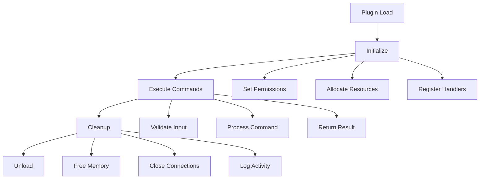

# Plugin Development Guide

## Overview

This guide provides comprehensive instructions for developing WASM plugins for the Connectias platform.

## Plugin Architecture

### 1. Plugin Structure

```
my-plugin/
├── Cargo.toml
├── src/
│   └── lib.rs
├── plugin.json
└── README.md
```

### 2. Plugin Lifecycle



## Development Setup

### 1. Prerequisites

```bash
# Install Rust with WASM target
curl --proto '=https' --tlsv1.2 -sSf https://sh.rustup.rs | sh
rustup target add wasm32-wasi

# Install wasm-pack
cargo install wasm-pack
```

### 2. Project Initialization

```bash
# Create new plugin project
cargo new my-connectias-plugin --lib
cd my-connectias-plugin

# Configure Cargo.toml
cat > Cargo.toml << EOF
[package]
name = "my-connectias-plugin"
version = "0.1.0"
edition = "2021"

[lib]
crate-type = ["cdylib"]

[dependencies]
wasm-bindgen = "0.2"
serde = { version = "1.0", features = ["derive"] }
serde_json = "1.0"
EOF
```

## Plugin Implementation

### 1. Basic Plugin Structure

```rust
// src/lib.rs
use wasm_bindgen::prelude::*;
use serde::{Deserialize, Serialize};

#[wasm_bindgen]
pub fn plugin_init() -> i32 {
    // Initialize plugin resources
    log::info!("Plugin initialized");
    0 // Success
}

#[wasm_bindgen]
pub fn plugin_execute(command: &str, args: &str) -> String {
    match command {
        "hello" => handle_hello(args),
        "calculate" => handle_calculate(args),
        "process_data" => handle_process_data(args),
        _ => {
            let error = serde_json::json!({
                "status": "error",
                "message": format!("Unknown command: {}", command)
            });
            error.to_string()
        }
    }
}

#[wasm_bindgen]
pub fn plugin_cleanup() {
    // Cleanup resources
    log::info!("Plugin cleanup completed");
}

// Command handlers
fn handle_hello(args: &str) -> String {
    let result = serde_json::json!({
        "status": "success",
        "message": "Hello from WASM plugin!",
        "args": args
    });
    result.to_string()
}

fn handle_calculate(args: &str) -> String {
    // Parse arguments with proper error handling
    let args: serde_json::Value = match serde_json::from_str(args) {
        Ok(value) => value,
        Err(e) => {
            let error_response = serde_json::json!({
                "status": "error",
                "message": format!("Invalid JSON: {}", e)
            });
            return error_response.to_string();
        }
    };
    
    let a = args["a"].as_f64().unwrap_or(0.0);
    let b = args["b"].as_f64().unwrap_or(0.0);
    let operation = args["operation"].as_str().unwrap_or("add");
    
    let result = match operation {
        "add" => a + b,
        "subtract" => a - b,
        "multiply" => a * b,
        "divide" => if b != 0.0 { a / b } else { f64::NAN },
        _ => f64::NAN,
    };
    
    let response = serde_json::json!({
        "status": "success",
        "result": result,
        "operation": operation
    });
    response.to_string()
}

fn handle_process_data(args: &str) -> String {
    // Process data based on arguments with proper error handling
    let args: serde_json::Value = match serde_json::from_str(args) {
        Ok(value) => value,
        Err(e) => {
            let error_response = serde_json::json!({
                "status": "error",
                "message": format!("Invalid JSON: {}", e)
            });
            return error_response.to_string();
        }
    };
    
    let data = args["data"].as_str().unwrap_or("");
    let operation = args["operation"].as_str().unwrap_or("uppercase");
    
    let processed_data = match operation {
        "uppercase" => data.to_uppercase(),
        "lowercase" => data.to_lowercase(),
        "reverse" => data.chars().rev().collect::<String>(),
        "length" => data.len().to_string(),
        _ => data.to_string(),
    };
    
    let response = serde_json::json!({
        "status": "success",
        "processed_data": processed_data,
        "operation": operation
    });
    response.to_string()
}
```

### 2. Plugin Configuration

```json
// plugin.json
{
  "id": "my-connectias-plugin",
  "name": "My Connectias Plugin",
  "version": "0.1.0",
  "description": "A sample plugin for Connectias",
  "author": "Your Name",
  "license": "MIT",
  "dependencies": [],
  "permissions": [
    "storage.read",
    "storage.write",
    "network.access"
  ],
  "commands": [
    {
      "name": "hello",
      "description": "Say hello",
      "args": {
        "message": "string"
      }
    },
    {
      "name": "calculate",
      "description": "Perform calculations",
      "args": {
        "a": "number",
        "b": "number",
        "operation": "string"
      }
    },
    {
      "name": "process_data",
      "description": "Process text data",
      "args": {
        "data": "string",
        "operation": "string"
      }
    }
  ],
  "resource_limits": {
    "max_memory": "100MB",
    "max_execution_time": "30s",
    "max_cpu_percent": "75%"
  }
}
```

## Advanced Features

### 1. Error Handling

```rust
use serde_json::json;

#[derive(Debug, Serialize, Deserialize)]
pub struct PluginError {
    pub code: i32,
    pub message: String,
    pub details: Option<String>,
}

impl PluginError {
    pub fn new(code: i32, message: String) -> Self {
        Self {
            code,
            message,
            details: None,
        }
    }
    
    pub fn with_details(mut self, details: String) -> Self {
        self.details = Some(details);
        self
    }
    
    pub fn to_json(&self) -> String {
        json!({
            "status": "error",
            "error": {
                "code": self.code,
                "message": self.message,
                "details": self.details
            }
        }).to_string()
    }
}

// Usage in command handlers
fn handle_risky_operation(args: &str) -> String {
    let result = perform_risky_operation(args);
    
    match result {
        Ok(data) => {
            json!({
                "status": "success",
                "data": data
            }).to_string()
        },
        Err(error) => {
            PluginError::new(500, "Operation failed".to_string())
                .with_details(error.to_string())
                .to_json()
        }
    }
}
```

### 2. Resource Management

```rust
use std::collections::HashMap;

pub struct PluginContext {
    pub memory_pool: Vec<u8>,
    pub connections: HashMap<String, String>,
    pub cache: HashMap<String, String>,
}

impl PluginContext {
    pub fn new() -> Self {
        Self {
            memory_pool: Vec::with_capacity(1024 * 1024), // 1MB
            connections: HashMap::new(),
            cache: HashMap::new(),
        }
    }
    
    pub fn allocate_memory(&mut self, size: usize) -> Result<&mut [u8], PluginError> {
        if self.memory_pool.len() + size > self.memory_pool.capacity() {
            return Err(PluginError::new(507, "Insufficient memory".to_string()));
        }
        
        let start = self.memory_pool.len();
        self.memory_pool.resize(start + size, 0);
        Ok(&mut self.memory_pool[start..start + size])
    }
    
    pub fn cleanup(&mut self) {
        self.memory_pool.clear();
        self.connections.clear();
        self.cache.clear();
    }
}
```

### 3. Security Best Practices

```rust
// Input validation
fn validate_input(args: &str) -> Result<serde_json::Value, PluginError> {
    let args: serde_json::Value = serde_json::from_str(args)
        .map_err(|e| PluginError::new(400, "Invalid JSON".to_string())
            .with_details(e.to_string()))?;
    
    // Validate required fields
    if !args.is_object() {
        return Err(PluginError::new(400, "Arguments must be an object".to_string()));
    }
    
    // Check for malicious content
    let args_str = args.to_string();
    if args_str.len() > 1024 * 1024 { // 1MB limit
        return Err(PluginError::new(413, "Arguments too large".to_string()));
    }
    
    Ok(args)
}

// Resource limits
fn check_resource_limits(context: &PluginContext) -> Result<(), PluginError> {
    if context.memory_pool.len() > 100 * 1024 * 1024 { // 100MB limit
        return Err(PluginError::new(507, "Memory limit exceeded".to_string()));
    }
    
    if context.connections.len() > 10 { // 10 connection limit
        return Err(PluginError::new(429, "Too many connections".to_string()));
    }
    
    Ok(())
}
```

## Building and Testing

### 1. Build Process

```bash
# Build for WASM
wasm-pack build --target web --out-dir pkg

# Build for production
wasm-pack build --target web --out-dir pkg --release
```

### 2. Testing

```rust
// tests/integration_tests.rs
use wasm_bindgen_test::*;

wasm_bindgen_test_configure!(run_in_browser);

#[wasm_bindgen_test]
fn test_plugin_init() {
    let result = plugin_init();
    assert_eq!(result, 0);
}

#[wasm_bindgen_test]
fn test_hello_command() {
    let result = plugin_execute("hello", "{\"message\": \"test\"}");
    let response: serde_json::Value = serde_json::from_str(&result).unwrap();
    assert_eq!(response["status"], "success");
}

#[wasm_bindgen_test]
fn test_calculate_command() {
    let args = json!({
        "a": 10,
        "b": 5,
        "operation": "add"
    });
    
    let result = plugin_execute("calculate", &args.to_string());
    let response: serde_json::Value = serde_json::from_str(&result).unwrap();
    assert_eq!(response["status"], "success");
    assert_eq!(response["result"], 15);
}
```

### 3. Local Testing

```bash
# Run tests
cargo test

# Run WASM tests
wasm-pack test --headless --firefox

# Test with Connectias
# Load plugin in Connectias and test commands
```

## Deployment

### 1. Plugin Packaging

```bash
# Create plugin package
mkdir my-plugin-package
cp pkg/my_connectias_plugin.wasm my-plugin-package/
cp plugin.json my-plugin-package/
cp README.md my-plugin-package/

# Create ZIP package
zip -r my-connectias-plugin-0.1.0.zip my-plugin-package/
```

### 2. Plugin Distribution

```bash
# Sign plugin (if required)
gpg --armor --detach-sign my-connectias-plugin-0.1.0.zip

# Upload to plugin store
# (Implementation depends on plugin store)
```

## Performance Optimization

### 1. Memory Management

```rust
// Use memory pools for frequent allocations
pub struct MemoryPool {
    chunks: Vec<Vec<u8>>,
    current_chunk: usize,
    current_offset: usize,
}

impl MemoryPool {
    pub fn new() -> Self {
        Self {
            chunks: vec![Vec::with_capacity(1024 * 1024)],
            current_chunk: 0,
            current_offset: 0,
        }
    }
    
    pub fn allocate(&mut self, size: usize) -> &mut [u8] {
        // Implementation for efficient memory allocation
        // ...
    }
}
```

### 2. Caching

```rust
use std::collections::HashMap;
use std::time::{SystemTime, UNIX_EPOCH};

pub struct Cache {
    data: HashMap<String, (String, u64)>, // key -> (value, timestamp)
    ttl: u64, // time to live in seconds
}

impl Cache {
    pub fn new(ttl: u64) -> Self {
        Self {
            data: HashMap::new(),
            ttl,
        }
    }
    
    pub fn get(&self, key: &str) -> Option<&String> {
        let (value, timestamp) = self.data.get(key)?;
        let now = SystemTime::now().duration_since(UNIX_EPOCH).unwrap().as_secs();
        
        if now - timestamp > self.ttl {
            None
        } else {
            Some(value)
        }
    }
    
    pub fn set(&mut self, key: String, value: String) {
        let timestamp = SystemTime::now().duration_since(UNIX_EPOCH).unwrap().as_secs();
        self.data.insert(key, (value, timestamp));
    }
}
```

## Troubleshooting

### 1. Common Issues

#### Memory Issues
```rust
// Check memory usage
fn check_memory_usage() {
    let memory_usage = get_memory_usage();
    if memory_usage > 100 * 1024 * 1024 { // 100MB
        log::warn!("High memory usage: {} bytes", memory_usage);
    }
}
```

#### Performance Issues
```rust
// Measure execution time
fn measure_execution_time<F, R>(f: F) -> (R, std::time::Duration)
where
    F: FnOnce() -> R,
{
    let start = std::time::Instant::now();
    let result = f();
    let duration = start.elapsed();
    (result, duration)
}
```

### 2. Debugging

```rust
// Enable logging
#[wasm_bindgen]
pub fn enable_logging() {
    console_log::init_with_level(log::Level::Debug).unwrap();
    log::info!("Logging enabled");
}

// Debug information
fn debug_info() -> String {
    json!({
        "memory_usage": get_memory_usage(),
        "timestamp": SystemTime::now().duration_since(UNIX_EPOCH).unwrap().as_secs(),
        "version": env!("CARGO_PKG_VERSION")
    }).to_string()
}
```

## Best Practices

### 1. Code Quality

- **Error Handling**: Always handle errors gracefully
- **Input Validation**: Validate all inputs
- **Resource Management**: Properly manage memory and connections
- **Security**: Follow security best practices
- **Testing**: Write comprehensive tests

### 2. Performance

- **Memory Efficiency**: Use memory pools and avoid unnecessary allocations
- **Caching**: Cache frequently used data
- **Optimization**: Profile and optimize critical paths
- **Resource Limits**: Respect resource limits

### 3. Security

- **Input Sanitization**: Sanitize all inputs
- **Resource Limits**: Enforce resource limits
- **Error Messages**: Don't leak sensitive information
- **Validation**: Validate all data

## Next Steps

- [Troubleshooting Guide](troubleshooting.md)
- [API Reference](../api/dart-api.md)
- [Security Guidelines](../security/security-guidelines.md)
- [Test Matrix](../testing/test-matrix.md)
